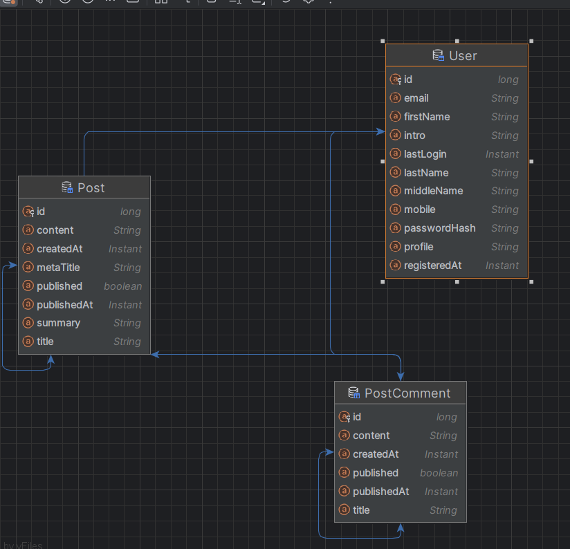

# www_lab6
# Projects Jakarta EE Week 6
- Sinh viên: **Nguyễn Văn Phú**
# Trang web blog công nghệ
## Back End
- Ánh xạ các entity, `repository` extends `JpaRepository`.  
- `Spring Boot - REST API`.   
  **Diagram:**
- 
## Front End
- `Spring MVC`.   

   

- [Login](#login)
- [Blog page](#blog-page)
- [Post page](#post-page)
- [Add post](#addPost-page)
- [Static Status Product](#staticStatus-product)
- [Static ProductPrice With day-month-year Product](#staticProductPrice-product)

## login (bấm submit chuyển sang trang blog)

## blog-page (bấm read more để xem post)
  + có add blog
  + đăng xuất
  + các bài post

## post-page
  + chi tiết bài post là những postComment đã comment vào bào post đó

## addPost-page

